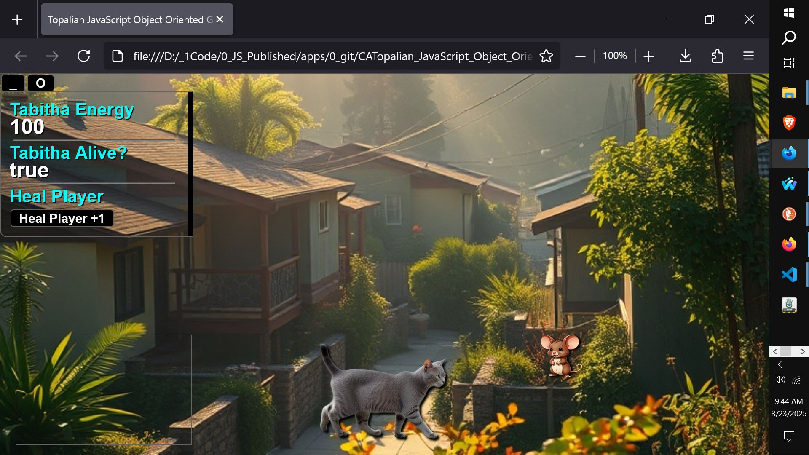

# CATopalian JavaScript Object Oriented  Game Design
A JavaScript Object Oriented Game Development Application

USE APP: https://christopherandrewtopalian.github.io/CATopalian_JavaScript_Object_Oriented_Game_Design/CATopalian_JavaScript_Object_Oriented_Game_Design.html  

  

---

### How to Download this App
1. Click the green Code Button on this github page
2. Choose Download ZIP
3. Save the Zip File
4. Extract All
5. Double click the HTML file to start the App

---

Happy Scripting :-)

